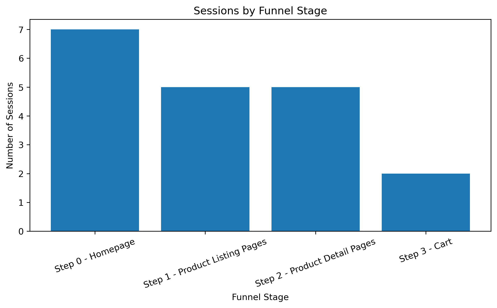
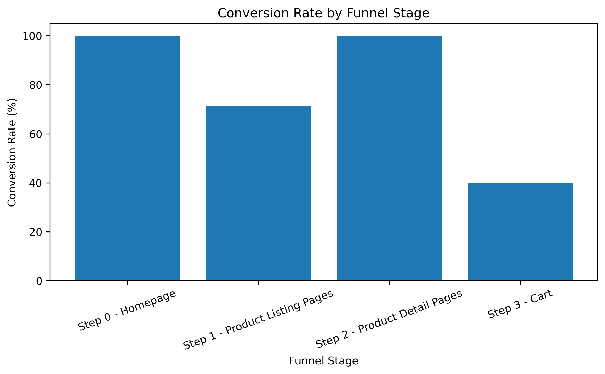
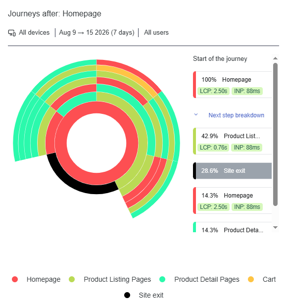

# Contentsquare Website Analytics

## Project Overview

This project analyses user behaviour and website performance using data collected from Contentsquare for an e-commerce storefront.

The analysis focuses on user engagement, page performance, navigation behaviour, and the conversion funnel from the Homepage through to the Cart.

## Objectives

- Analyse user sessions and engagement
- Examine page views and website performance
- Understand user navigation journeys
- Identify funnel drop-off points
- Analyse conversion between funnel stages
- Produce visualisations of user behaviour
- Provide practical UX and business recommendations

## Tools & Technologies

- Python
- Pandas
- Matplotlib
- Jupyter Notebook
- Contentsquare
- Excel

## Data Source

The analysis uses data exported from Contentsquare based on activity recorded on the e-commerce storefront.

The available dataset covers 7 sessions during the analysis period. Due to the small sample size, findings are treated as observations and areas for further investigation rather than statistically representative conclusions.

## Key Metrics

| Metric | Result |
|---|---:|
| Total Sessions | 7 |
| Total Page Views | 120 |
| Bounce Rate | 28.57% |
| Average Page Views per Session | 17.14 |
| Homepage → Cart Conversion | 28.57% |
| Cart Drop-off Rate | 60% |

## Funnel Analysis

The observed user journey was:

**Homepage → Product Listing Pages → Product Detail Pages → Cart**

| Funnel Stage | Sessions | Conversion Rate |
|---|---:|---:|
| Homepage | 7 | 100% |
| Product Listing Pages | 5 | 71.43% |
| Product Detail Pages | 5 | 100% |
| Cart | 2 | 40% |

The largest observed drop-off occurred at the Cart stage, where 3 sessions were lost from the previous stage.

## Visual Analysis

### Sessions by Funnel Stage

The chart shows the number of sessions progressing through each stage of the observed user journey.

### Conversion Rate by Funnel Stage

The conversion-rate comparison highlights the Cart stage as the main observed point of drop-off.

### Contentsquare Journey Analysis

The Contentsquare journey visualisation shows the observed navigation paths from the Homepage through the defined page groups.

## Key Findings

- 7 sessions generated 120 page views during the analysis period.
- Average page views per session were 17.14.
- The overall Homepage-to-Cart conversion was 28.57%.
- The largest observed drop-off occurred at the Cart stage, with a 60% drop-off rate.
- Product Detail Pages showed 100% conversion from the preceding funnel stage in the observed data.

## Recommendations

- Investigate potential friction within the Cart and checkout experience.
- Review navigation and usability around the transition from Product Detail Pages to Cart.
- Continue collecting data to establish a larger sample size.
- Reassess funnel performance as more user sessions become available.

## Limitations

The analysis is based on a small sample of 7 sessions. The results should therefore be treated as directional observations rather than statistically representative conclusions about the wider customer population.

## Project Files

- `ContentsquareAnalysis.ipynb` — Python analysis and visualisations
- `2026-08-15-journey-analysis.png` — Contentsquare journey analysis
- `Key Performance Metrics-08_15_2026-Contentsquare.xlsx` — Contentsquare key performance metrics
- `New dashboard-08_15_2026-Contentsquare.xlsx` — Contentsquare funnel data
- `Segment-08_15_2026-Contentsquare.xlsx` — Contentsquare segment data

**AI Assistance:** AI was used for coding assistance, troubleshooting, and validation throughout the project. The analysis and final decisions were reviewed and completed by me.
