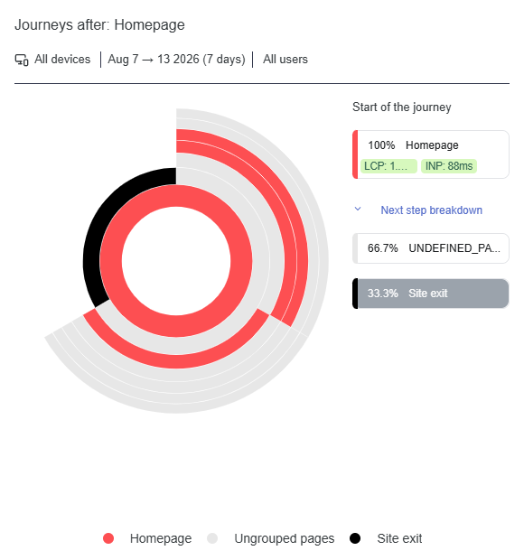

# Contentsquare Website Analytics

## Project Overview

This project analyses website behaviour and user engagement data collected using Contentsquare and subsequently analysed using Python.

The objective was to understand website performance, identify user engagement patterns and translate website analytics into practical UX and business insights.

The project demonstrates an end-to-end analytics workflow:

**Website → Contentsquare → Data Export → Python/Pandas → Analysis → Visualisation → UX Recommendations**

---

## Objectives

The main objectives of this project were to:

- Analyse website traffic and session activity
- Measure website engagement
- Analyse bounce rate and session behaviour
- Examine changes in website activity over time
- Analyse available device-level performance
- Explore user navigation and journey behaviour
- Identify potential areas for UX improvement
- Create visualisations to communicate findings
- Develop practical UX and business recommendations

---

## Data Source

The data analysed in this project was exported from **Contentsquare**, based on activity recorded on the website during the reporting period.

The Contentsquare export contained website performance information including:

- Number of sessions
- Bounce rate
- Views per session
- Session time
- Sessions by device
- Bounce rate by device
- Daily session activity
- User journey information
- Page-view information

The exported data was then loaded into Python for cleaning, analysis and visualisation.

---

## Tools & Technologies

- **Python**
- **Pandas**
- **Matplotlib**
- **Jupyter Notebook**
- **Contentsquare**

---

# Website Performance Analysis

The main website performance metrics identified from the Contentsquare export were:

| Metric | Result |
|---|---:|
| Total Sessions | 3 |
| Overall Bounce Rate | 33.33% |
| Views per Session | 24.67 |
| Average Session Time | 756.53 seconds |
| Average Session Time | ~12.6 minutes |
| Peak Sessions | 2 on 12/08/2026 |
| Peak Bounce Rate | 50% on 12/08/2026 |

### Interpretation

The website recorded 3 sessions during the reporting period.

The average session time was approximately 12.6 minutes, while the average number of views per session was 24.67.

These figures indicate that the recorded sessions contained a relatively high level of activity. However, because the dataset contains only 3 sessions, the results should be treated as directional rather than representative of the wider website audience.

A larger volume of website traffic would be required to establish reliable behavioural trends.

---

# Daily Website Sessions

The daily session data was analysed to understand how website activity changed during the reporting period.

**Figure 1 – Daily Website Sessions**

The analysis showed no recorded sessions between 7 and 11 August.

Website activity then increased on 12 August, when 2 sessions were recorded, followed by 1 session on 13 August.

This demonstrates how daily session analysis can be used to identify periods of increased website activity and provides a basis for investigating what may have driven changes in traffic.

Due to the small number of sessions, however, the increase should not be interpreted as a statistically significant traffic trend.

---

# Daily Website Bounce Rate

**Figure 2 – Daily Website Bounce Rate**

The daily bounce-rate analysis showed a peak of **50% on 12 August 2026**.

The other days recorded a 0% bounce rate because there was little or no session activity.

The 50% value indicates that one of the two sessions recorded on 12 August resulted in a bounce. However, with only two sessions on that day, a single user has a large effect on the percentage.

Therefore, the result is useful as an observation but would require a larger dataset before drawing conclusions about overall website performance.

---

# Device Performance

The Contentsquare export recorded activity from desktop devices.

The available desktop metrics were:

- **Sessions:** 3
- **Bounce Rate:** 33.33%

The dataset did not contain enough activity across multiple device types to make a meaningful comparison between desktop and mobile users.

As more website traffic is collected, device-level analysis could be used to identify differences in engagement, bounce behaviour and potential responsive-design issues.

---

# Contentsquare Journey Analysis

Contentsquare Journey Analysis was used to examine how visitors moved through the website from the Homepage during the reporting period.

The following image was exported from Contentsquare and shows the observed journey behaviour for **7–13 August 2026** across all users and devices.

### Contentsquare Journey Analysis



### Analysis of the Journey

The Contentsquare Journey Analysis shows that **100% of the recorded journeys started on the Homepage**.

From the Homepage:

- **66.7%** of journeys continued to an `UNDEFINED_PA...` next step.
- **33.3%** of journeys resulted in a **site exit**.

The 33.3% site-exit figure indicates that one of the three recorded sessions ended after the Homepage journey.

The majority of observed journeys continued beyond the Homepage, with 66.7% progressing to a subsequent step.

The `UNDEFINED_PA...` label indicates that Contentsquare recorded a subsequent journey step that was not clearly represented by a defined page label in the exported journey view. This limits the ability to identify the exact destination from this particular export.

The journey analysis therefore provides useful evidence that visitors were not exclusively leaving immediately from the Homepage, while also highlighting an area where clearer page identification or additional journey analysis could provide more insight.

### Relationship to Website Performance

The Journey Analysis adds behavioural context to the numerical performance metrics.

The overall website data recorded:

- 3 total sessions
- 33.33% overall bounce rate
- 24.67 views per session
- Approximately 12.6 minutes average session time

The journey data supports the observation that some visitors continued beyond the Homepage rather than immediately exiting.

However, because only 3 sessions were recorded, each individual journey has a substantial effect on the percentages.

---

# Key Findings

The analysis identified the following key findings:

### 1. Low overall traffic volume

Only 3 sessions were recorded during the reporting period.

This means the analysis provides an initial view of website behaviour rather than a statistically representative picture of the full audience.

### 2. Website activity was concentrated towards the end of the period

All recorded activity occurred on 12 and 13 August, with 2 sessions on 12 August and 1 session on 13 August.

### 3. Engagement within recorded sessions was relatively high

The recorded average was 24.67 views per session, with an average session time of approximately 12.6 minutes.

These figures suggest that the recorded visitors interacted with the website beyond a single page view.

### 4. Bounce behaviour varied during the period

The overall bounce rate was 33.33%, while the daily bounce rate reached 50% on 12 August.

With such a small number of sessions, these percentages are highly sensitive to individual user behaviour.

### 5. Homepage was the main journey starting point

The Contentsquare Journey Analysis showed that 100% of recorded journeys started from the Homepage.

### 6. Most recorded journeys continued beyond the Homepage

66.7% of journeys continued to a subsequent step, while 33.3% resulted in a site exit.

### 7. Journey data highlighted an area for further investigation

The next-step journey was partially represented as `UNDEFINED_PA...` in the Contentsquare export.

This means additional journey or page-level analysis would be useful to determine exactly where users continued after the Homepage.

---

# UX & Business Recommendations

Because of the limited number of sessions, these recommendations should be considered areas for further investigation rather than definitive conclusions.

## 1. Continue monitoring website traffic

Collecting a larger volume of sessions would provide a stronger basis for identifying reliable traffic and engagement patterns.

## 2. Investigate Homepage journeys

The Homepage was the starting point for all observed journeys.

Future analysis should examine which pages users visit after the Homepage and whether certain navigation paths consistently lead to exits.

## 3. Investigate unidentified journey steps

The `UNDEFINED_PA...` journey step should be investigated within Contentsquare to determine which page or interaction it represents.

Clearer page identification would make journey analysis more useful for understanding navigation behaviour.

## 4. Monitor bounce behaviour

Future Contentsquare data could be used to identify specific pages and journeys associated with higher bounce rates.

This could help identify potential navigation, content or UX issues.

## 5. Analyse device behaviour as traffic increases

A larger dataset would allow desktop and mobile behaviour to be compared more effectively.

This could help identify device-specific differences in engagement and user experience.

## 6. Continue using journey analysis

Contentsquare Journey Analysis can be used over a longer period to identify common navigation paths, potential drop-off points and opportunities to improve the website experience.

---

# Limitations

The main limitation of this project is the small amount of recorded website activity.

Only **3 sessions** were available during the reporting period. Consequently, percentages such as the 33.33% overall bounce rate and 66.7% journey continuation rate are based on very few observations.

The findings should therefore be treated as **directional insights rather than statistically representative conclusions**.

The journey export also contained an `UNDEFINED_PA...` next-step label, which limited the ability to identify the exact destination of those journeys from the exported view.

Despite these limitations, the project demonstrates how website analytics can be transformed into structured insights using Python.

---

# Project Structure

```text
contentsquare-website-analytics/
│
├── ContentsquareAnalysis.ipynb
├── 2026-08-13-journey-analysis.png
└── README.md
